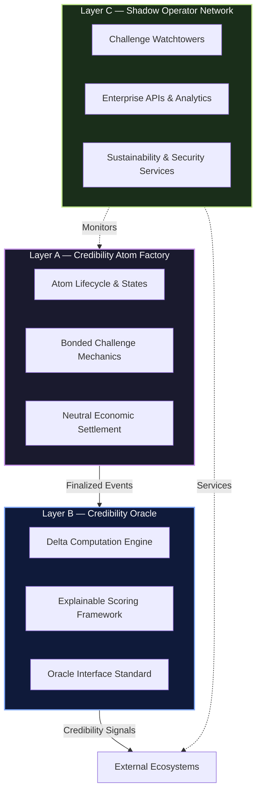
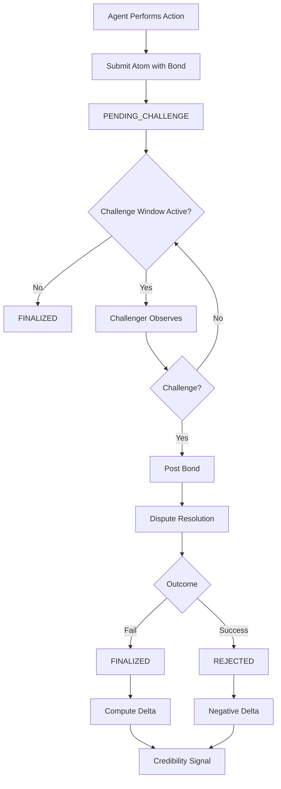

```markdown
# 🧠 OAPS Protocol — The Credibility Atom Protocol

> A neutral, adversarial substrate for trust.  
> Proof of Fact, Curated by Incentives.

OAPS defines a foundational primitive — the **Credibility Atom** — enabling the generation of non-transferable, history-dependent credibility signals for any agent (human or artificial) through economically bonded challenge games.

[](LICENSE)
[](https://oaps-signer-dapp.vercel.app)
[](./SPECIFICATION.md)
[](https://sepolia.etherscan.io/address/0x83e7593D3c8343437d92094d9485D6eDBfF89131)

---

🚀 **Live dApp — Operational Foundation**

**OAPS Proof Builder & Registry (v0.1)**  
Build, sign, and register immutable proofs on the Sepolia testnet.

🔗 [Live dApp](https://oaps-signer-dapp.vercel.app)

This system constitutes Layer A (v0.1) of the protocol and demonstrates the complete end-to-end pipeline:

> Agent input → cryptographic commitment → on-chain settlement

The system is intentionally minimal, neutral, and judgment-free.

---

📜 **Abstract — From Registry to Protocol**

OAPS v0.1 established a neutral, on-chain proof-of-existence registry for professional claims (audits, attestations, task execution).

The **Credibility Atom Protocol** evolves this registry into a dynamic system where:

> Proofs are not endpoints — they are the opening state of an adversarial game.

---

⚛️ **The Credibility Atom**

A Credibility Atom is a cryptographically verifiable record of an agent’s completed action or claim that:

- is submitted with economic stake,
- is exposed to bonded challenge for a fixed window,
- is finalized only after adversarial scrutiny,
- produces a non-transferable, history-dependent credibility delta.

**Design Outcomes**

- Dishonesty becomes economically irrational
- Silence (no challenge) becomes a meaningful signal
- Trust is replaced by adversarial verification

> Validity ≠ Quality  
> Layer A never judges truth. It only settles incentives.

---

🏗️ **Protocol Architecture — Three-Layer Stack**



---

🧱 **Layer Details**

🔒 **Layer A — Credibility Atom Factory (Settlement Layer)**

**Function:** Immutable, judgment-free settlement layer where Credibility Atoms are minted, challenged, and economically resolved.

**Properties:**
- Explicit state machine: PENDING → FINALIZED / REJECTED
- Bonded challenge windows
- Deterministic economic outcomes

**Status:**
- ✅ v0.1 live: OAPSRegistryV0
- 🔜 v1 upgrade: bonded challenges + dispute resolution

**Core Principle:**  
> Brutal neutrality. Layer A never evaluates truth or quality.

---

🧮 **Layer B — Credibility Oracle (Intelligence Layer)**

**Function:** Consumes finalized Layer A events and computes credibility deltas.

**Constraints:**
- Non-transferable
- History-dependent
- Stake-weighted, game-resistant

**Key Design Choice:**  
Explainability over full transparency  
(framework public, weightings sovereign)

**Status:**  
🔄 RFC active — ACCREDITATION.md  
Reference oracle + open interface for competing models

---

🕶️ **Layer C — Shadow Operator Network (Sustainability Layer)**

**Function:** Provides premium, non-privileged services that sustain protocol security and adoption.

**Examples:**
- Automated challenge watchtowers
- High-throughput APIs & dashboards
- Adversarial simulation and stress testing

**Principle:**  
> Service without capture. No special rights over protocol logic.

---

🔁 **Credibility Atom Lifecycle**



---

🎯 **Core Use Cases**

- 🤖 AI Agent Accountability — Verifiable execution histories for autonomous agents
- 🔐 Security & Code Audits — Economic skin-in-the-game replaces blind trust
- 🏛️ DAO Governance — Reputation derived from action, not tokens
- 📜 RWA & Compliance — Immutable attestations for real-world assets
- 🚀 Jurisdiction-less Coordination — Neutral trust primitive for autonomous systems

---

📊 **Current Implementation (v0.1)**

| Component          | Details                                                                 |
|--------------------|-------------------------------------------------------------------------|
| Network            | Sepolia Testnet                                                         |
| Registry Contract  | OAPSRegistryV0                                                          |
| Contract Address   | 0x83e7593D3c8343437d92094d9485D6eDBfF89131                            |
| Live dApp          | https://oaps-signer-dapp.vercel.app                                     |
| Pilot Proofs       | Guard Check • State Machine                                             |

---

🗺️ **Roadmap to Indispensability**

**Q1 2026 — Formalize & Fortify**  
- Finalize CAS-001 specification  
- Deploy OAPSRegistryV1 (bonded challenges)  
- Launch public adversarial bug bounty  

**Q2 2026 — Activate Intelligence**  
- Deploy Reference Credibility Oracle  
- First hard-dependency ecosystem integration  

**2026+ — Standardization & Scale**  
- Standards engagement (W3C Verifiable Credentials, etc.)  
- Expand Shadow Operator Network  
- Civilizational-scale coordination use cases  

---

📚 **Documentation**

- CAS-001.md — Credibility Atom Specification (Draft)  
- ACCREDITATION.md — Credibility Oracle RFC  
- GETTING_STARTED.md — v0.1 usage guide  
- MILESTONES.md — Public progress tracking  

---

🤝 **Contributing**

OAPS is open infrastructure for serious builders.

- RFCs & issues → GitHub Issues  
- Integration / pilots → DM @ultimateshield4  
- Follow progress → Watch this repository  

---

📄 **License & Disclaimer**

**License:** MIT License — see LICENSE for details.

**Disclaimer:** OAPS provides cryptographic registration, adversarial challenge mechanisms, and derived credibility signals. It does not judge truth, correctness, safety, or outcomes. All usage is at your own risk. Always conduct independent due diligence.

---

**Core Principle (Non-Negotiable)**

> Validity ≠ Quality  
> Proof of Fact, Curated by Incentives.
```