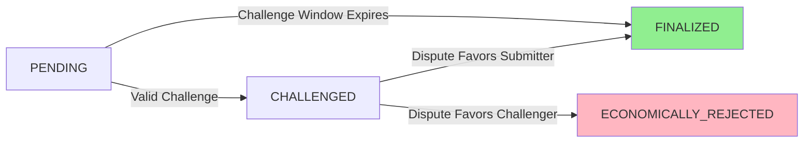

Credibility Atom Specification (CAS-001)

1. Abstract

This specification defines the Credibility Atom — the foundational primitive of the OAPS Protocol. A Credibility Atom is a cryptographically verifiable claim, submitted with economic stake, exposed to bonded challenge, and resolved through adversarial scrutiny to produce a non-transferable, history-dependent credibility signal.

2. Introduction

2.1 Problem Statement

Current verification systems rely on trusted authorities or static proofs. There exists no neutral, economically-secured primitive that transforms assertions into trust through adversarial games, creating signals resistant to Sybil attacks and long-con strategies.

2.2 Goals

1. Define an atomic unit of verifiable action that is economically secured.
2. Create a neutral settlement layer that resolves challenges without qualitative judgment.
3. Generate non-transferable credibility signals that are history-dependent and game-resistant.
4. Establish a foundation for adversarial truth discovery across multiple domains (AI, security, governance).

2.3 Non-Goals

· Determining absolute "truth" or qualitative correctness
· Replacing legal or regulatory frameworks
· Acting as a guarantee of safety or performance
· Creating a tradable reputation asset

3. Definitions

Agent: An entity (human or artificial) that submits Credibility Atoms. Identified by a cryptographic public key.

Credibility Atom: The complete atomic unit as defined in this specification.

Base Proof: The structured claim (JSON) following the OAPS v0.1 schema, forming the informational core of an Atom.

Bond: An economic stake (in native protocol token or ETH) required for Atom submission and challenges.

Challenge Window: A fixed-duration period during which a submitted Atom can be disputed.

Credibility Delta: A non-transferable, history-dependent signal computed from an agent's Atom history by a Credibility Oracle.

Finalization: The state transition of an Atom to either FINALIZED or ECONOMICALLY_REJECTED.

Slashing: The punitive removal and redistribution of a bond due to a failed challenge or submission.

4. Credibility Atom Structure

A Credibility Atom is composed of two integrated components: a Base Proof and Economic Metadata.

4.1 Base Proof Schema

The Base Proof adheres to the canonical OAPS v0.1 JSON schema (CAS-001 inherits and extends v0.1), with one critical addition:

```json
{
  "version": {
    "type": "string",
    "const": "CAS-001",
    "description": "The Credibility Atom specification version."
  },
  "oapsVersion": {
    "type": "string",
    "const": "0.1.0",
    "description": "The OAPS specification version."
  },
  "auditId": {
    "type": "string",
    "pattern": "^[a-fA-F0-9]{8}-[a-fA-F0-9]{4}-[a-fA-F0-9]{4}-[a-fA-F0-9]{4}-[a-fA-F0-9]{12}$",
    "description": "A unique, version 4 UUID for this audit engagement."
  },
  "project": {
    "type": "object",
    "required": ["name", "address", "blockchain"],
    "properties": {
      "name": {
        "type": "string",
        "description": "The canonical name of the project."
      },
      "address": {
        "type": "string",
        "description": "The primary contract address (0x...) or project identifier."
      },
      "blockchain": {
        "type": "string",
        "pattern": "^[a-z][a-z0-9-]*$",
        "example": "ethereum",
        "description": "Lowercase blockchain identifier."
      }
    }
  },
  "auditor": {
    "type": "object",
    "required": ["id"],
    "properties": {
      "id": {
        "type": "string",
        "description": "The auditor's cryptographic identity (0x... Ethereum address)."
      },
      "name": {
        "type": "string",
        "description": "Optional human-readable label."
      }
    }
  },
  "auditScope": {
    "type": "object",
    "required": ["commitHash"],
    "properties": {
      "commitHash": {
        "type": "string",
        "pattern": "^[a-f0-9]{40}$",
        "description": "The full SHA-1 Git commit hash of the audited codebase."
      },
      "files": {
        "type": "array",
        "items": {
          "type": "object",
          "required": ["path", "hash"],
          "properties": {
            "path": { "type": "string" },
            "hash": { 
              "type": "string", 
              "pattern": "^[a-f0-9]{64}$",
              "description": "SHA-256 hash of the file."
            }
          }
        },
        "description": "Optional array of specific file paths and their hashes."
      }
    }
  },
  "reportHash": {
    "type": "string",
    "pattern": "^[a-f0-9]{64}$",
    "description": "The SHA-256 hash of the final audit report."
  },
  "timestamp": {
    "type": "string",
    "format": "date-time",
    "description": "ISO 8601 UTC timestamp of proof generation."
  },
  "findingsSummary": {
    "type": "object",
    "properties": {
      "critical": { "type": "integer", "minimum": 0, "default": 0 },
      "high": { "type": "integer", "minimum": 0, "default": 0 },
      "medium": { "type": "integer", "minimum": 0, "default": 0 },
      "low": { "type": "integer", "minimum": 0, "default": 0 },
      "informational": { "type": "integer", "minimum": 0, "default": 0 }
    },
    "description": "OPTIONAL. Summary counts for indexing only."
  }
}
```

4.2 Atom Economic Metadata

This off-chain structure is signed by the agent and committed to the settlement layer (Layer A).

```json
{
  "$schema": "https://json-schema.org/draft/2020-12/schema",
  "title": "Credibility Atom Economic Metadata",
  "type": "object",
  "required": [
    "baseProofHash",
    "agentAddress",
    "submissionBond",
    "challengeWindowSeconds",
    "disputeResolverId"
  ],
  "properties": {
    "baseProofHash": {
      "type": "string",
      "pattern": "^0x[a-fA-F0-9]{64}$",
      "description": "The keccak256 hash of the canonicalized Base Proof JSON string."
    },
    "agentAddress": {
      "type": "string",
      "pattern": "^0x[a-fA-F0-9]{40}$",
      "description": "The Ethereum address of the submitting agent (must sign this metadata)."
    },
    "submissionBond": {
      "type": "string",
      "pattern": "^[0-9]+$",
      "description": "The amount of bonded stake (in wei) the agent risks upon submission."
    },
    "challengeWindowSeconds": {
      "type": "integer",
      "minimum": 3600,
      "maximum": 604800,
      "description": "Duration (in seconds) the Atom remains open for challenge. Must be between 1 hour and 7 days."
    },
    "disputeResolverId": {
      "type": "string",
      "description": "Identifier for the dispute resolution mechanism (e.g., 'OAPS_ARBITRATION_V1', 'KLEROS_ETH')."
    },
    "contextUri": {
      "type": "string",
      "format": "uri",
      "description": "Optional URI pointing to additional context required to evaluate the Base Proof claim."
    }
  }
}
```

4.3 Atom Commitment Hash

The unique identifier for a Credibility Atom is:

```
atomHash = keccak256(
  abi.encodePacked(
    baseProofHash,
    agentAddress,
    submissionBond,
    challengeWindowSeconds,
    disputeResolverId
  )
)
```

5. Lifecycle & State Machine

5.1 State Definitions

PENDING: Atom is submitted and bond is locked. Challenge window is active.

CHALLENGED: A valid challenge with sufficient bond has been initiated. Dispute resolution is ongoing.

FINALIZED: Challenge window passed without challenge, or dispute resolved in submitter's favor. Bond returned.

ECONOMICALLY_REJECTED: Dispute resolved in challenger's favor. Submission bond slashed.

5.2 State Transition Diagram



6. Bonded Challenge Mechanics

6.1 Submission

1. Agent prepares Base Proof and Economic Metadata.
2. Agent signs atomHash with private key corresponding to agentAddress.
3. Agent calls submitAtom() on Layer A contract, providing:
   · atomHash
   · signature
   · submissionBond (transferred and locked)

6.2 Challenge

1. Any actor with a staking bond can call challengeAtom(atomHash) during the challenge window.
2. Challenger must lock a challengeBond (equal to or greater than submissionBond).
3. Atom transitions to CHALLENGED state.
4. Dispute resolution process begins (see 6.3).

6.3 Dispute Resolution

The protocol is agnostic to specific resolution mechanisms but requires they are:

· Deterministic (same inputs produce same outcome)
· Bounded in time
· Cryptographic verifiable

Default Mechanism (OAPS Arbitration V1):

1. A panel of N randomly selected, bonded jurors are assigned.
2. Jurors examine Base Proof and contextUri against predefined evaluation criteria.
3. Jurors vote VALID or INVALID via commit-reveal.
4. Outcome determined by supermajority (≥ ⅔).

6.4 Economic Settlement

No Challenge

· Submitter Bond: Returned 100%
· Challenger Bond: N/A
· Next State: FINALIZED

Challenge Fails

· Submitter Bond: Returned 100%
· Challenger Bond: Slashed 100% → to submitter
· Next State: FINALIZED

Challenge Succeeds

· Submitter Bond: Slashed 100% → to challenger
· Challenger Bond: Returned 100%
· Next State: ECONOMICALLY_REJECTED

7. Economic Invariants

The following mathematical properties MUST hold for the system to be game-theoretically sound:

7.1 Attack Cost Invariant

```
Cost_of_Successful_Attack > Potential_Profit × Probability_of_Success
```

Where:

· Cost_of_Successful_Attack = submissionBond + challengeBond + operational_costs
· Potential_Profit is the value extractable from a fraudulent proof being accepted
· Probability_of_Success is the estimated chance of defeating the dispute resolution

7.2 Participation Incentive Invariant

```
Expected_Value(Honest_Challenge) > Cost_of_Challenge
```

For honest challengers to exist, the expected reward from slashed bonds must exceed the time and gas costs of monitoring and challenging.

7.3 Parameter Constraints

· MIN_SUBMISSION_BOND ≥ 1 ETH (or equivalent protocol token value)
· CHALLENGE_BOND_RATIO = 1.0 (challenger must match submission bond)
· CHALLENGE_WINDOW_MIN = 24 hours
· CHALLENGE_WINDOW_MAX = 7 days

8. Security & Threat Model

8.1 Considered Threats

Sybil Attacks

· Mitigation: High submission bond requirement; non-transferable deltas.

Long-Con Attacks

· Mitigation: History-dependent delta calculation with exponential decay on inaction.

Griefing/Spam Challenges

· Mitigation: Challenge bond equal to submission bond; slashing on failure.

Juror Collusion

· Mitigation: Random selection from large, bonded pool; supermajority voting.

Data Unavailability

· Mitigation: contextUri must be available during challenge window; use of decentralized storage with incentives.

8.2 Trust Assumptions

1. The underlying blockchain provides consensus and timestamping.
2. Dispute resolution jurors are majority honest for the default mechanism.
3. Economic incentives are properly calibrated (see Section 7).
4. Agents have secure key management.

9. Credibility Delta Framework

9.1 Oracle Interface Specification

Layer B Credibility Oracles MUST implement the following interface:

```solidity
interface ICredibilityOracle {
    struct Delta {
        address agent;
        int256 delta;
        uint256 timestamp;
        bytes32 atomHash;
        bytes proof;
    }
    
    function computeDelta(
        address agent,
        bytes32[] memory finalizedAtomHashes,
        bytes32[] memory rejectedAtomHashes
    ) external view returns (Delta memory);
}
```

9.2 Delta Computation Principles

1. Non-transferability: Deltas are bound to agentAddress and cannot be sold or transferred.
2. History-dependence: Current delta is a function of all previous deltas and new outcomes.
3. Stake-weighting: Atoms with higher bonds have greater impact on delta.
4. Time decay: The impact of old Atoms diminishes exponentially over time (halflife = 90 days).

9.3 Reference Algorithm (Simplified)

```
function computeDelta(agent):
    total_score = 0
    for each atom in agent_history:
        age = current_time - atom.timestamp
        weight = atom.bond * (0.5 ^ (age / 90_days))
        
        if atom.state == FINALIZED:
            total_score += weight
        else if atom.state == ECONOMICALLY_REJECTED:
            total_score -= weight * REJECTION_MULTIPLIER
    
    return normalize_score(total_score)
```

10. Implementation Guidelines

10.1 Layer A Smart Contract

The CredibilityAtomRegistry MUST implement:

· Atom submission with bond locking
· Challenge initiation with bond matching
· Dispute resolution coordination
· Economic settlement execution
· State transition enforcement

10.2 Data Availability

· Base Proofs SHOULD be stored on IPFS or Arweave
· contextUri MUST be accessible during the entire challenge window
· All economic metadata MUST be emitted as contract events

10.3 Upgrade Path from v0.1

1. OAPSRegistryV0 remains as a legacy registry
2. CredibilityAtomRegistry deploys as separate contract
3. Migration tool allows v0.1 proofs to be "wrapped" into Atoms with additional bond

11. Versioning & Governance

This is specification CAS-001.

1. Ratification: This specification becomes active upon deployment of the first CredibilityAtomRegistry to mainnet Ethereum.
2. Amendments: Changes require a Credibility Atom Improvement Proposal (CAIP) process, voted on by agents with positive credibility deltas.
3. Compatibility: CAS-002+ will maintain backward compatibility for Atom structure or provide a migration path.

---

Status: FINAL
Last Updated: 2026-01-25
Authors: OAPS Protocol Contributors
License: CC BY-SA 4.0