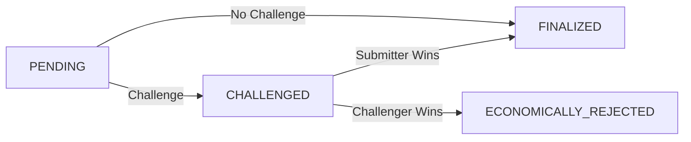

```markdown
# Credibility Atom Specification (CAS-001)

**Status:** DRAFT  
**Protocol:** OAPS – Open Audit Proof System  
**Last Updated:** 2026-01-25  
**License:** CC BY-SA 4.0  

---

## 1. Abstract

This specification defines the **Credibility Atom**, the foundational primitive of the OAPS Protocol.

A Credibility Atom is a cryptographically verifiable claim, submitted with economic stake, exposed to bonded challenge, and resolved through adversarial scrutiny to produce a **non-transferable, history-dependent credibility signal**.

---

## 2. Introduction

### 2.1 Problem Statement

Current verification systems rely on trusted authorities or static proofs. There exists no neutral, economically-secured primitive that transforms assertions into trust through adversarial games.

### 2.2 Goals

1. Economically secured verifiable actions  
2. Neutral dispute settlement without qualitative judgment  
3. Non-transferable, history-dependent credibility  
4. Adversarial truth discovery  

### 2.3 Non-Goals

- Determining absolute truth  
- Replacing legal systems  
- Tradable reputation  

---

## 3. Definitions

| Term                     | Definition                                                                 |
|--------------------------|----------------------------------------------------------------------------|
| Agent                    | Entity identified by a cryptographic key                                   |
| Credibility Atom         | Atomic unit defined by this spec                                           |
| Base Proof               | Structured claim (OAPS v0.1 format)                                        |
| Bond                     | Economic stake (ETH or ERC-20)                                             |
| Challenge Window         | Period for dispute                                                         |
| Credibility Delta        | Non-transferable signal produced by Layer B                                |
| Slashing                 | Economic penalty on bond                                                   |

---

## 4. Credibility Atom Structure

### 4.1 Base Proof Extension

```json
{
  "version": "CAS-001",
  "baseProof": {
    // OAPS v0.1 proof object
  },
  "economicMetadata": {
    "submissionBond": "string",           // wei as string
    "challengeWindowSeconds": "integer",
    "disputeResolverId": "string"
  }
}
```

### 4.2 Economic Metadata Schema

```json
{
  "$schema": "https://json-schema.org/draft/2020-12/schema",
  "title": "Credibility Atom Economic Metadata",
  "type": "object",
  "required": [
    "baseProofHash",
    "agentAddress",
    "submissionBond",
    "challengeWindowSeconds",
    "disputeResolverId"
  ],
  "properties": {
    "baseProofHash": {
      "type": "string",
      "pattern": "^0x[a-fA-F0-9]{64}$"
    },
    "agentAddress": {
      "type": "string",
      "pattern": "^0x[a-fA-F0-9]{40}$"
    },
    "submissionBond": {
      "type": "string",
      "pattern": "^[0-9]+$"
    },
    "challengeWindowSeconds": {
      "type": "integer",
      "minimum": 3600,
      "maximum": 604800
    },
    "disputeResolverId": {
      "type": "string"
    },
    "contextUri": {
      "type": "string",
      "format": "uri"
    }
  }
}
```

### 4.3 Atom Commitment Hash

```solidity
atomHash = keccak256(
  abi.encodePacked(
    baseProofHash,
    agentAddress,
    submissionBond,
    challengeWindowSeconds,
    disputeResolverId
  )
)
```

---

## 5. Lifecycle & State Machine

### 5.1 States

| State                  | Description                                      |
|------------------------|--------------------------------------------------|
| PENDING                | Atom submitted, bond locked                      |
| CHALLENGED             | Active bonded dispute                            |
| FINALIZED              | Accepted, bond returned                          |
| ECONOMICALLY_REJECTED  | Invalidated, bond slashed                        |

### 5.2 State Diagram



---

## 6. Bonded Challenge Mechanics

### 6.1 Submission

1. Prepare Base Proof  
2. Compute atomHash  
3. Sign hash with agent key  
4. Submit Atom with bond to Layer A  

### 6.2 Challenge

- Any actor may challenge during window  
- Challenger posts matching bond  
- Atom enters CHALLENGED state  

### 6.3 Dispute Resolution (Default)

- Random bonded jurors  
- Commit-reveal voting  
- ≥ ⅔ supermajority decides outcome  

### 6.4 Economic Settlement

| Outcome              | Submitter Bond | Challenger Bond |
|----------------------|----------------|-----------------|
| No Challenge         | Returned       | —               |
| Challenge Fails      | Returned       | Slashed         |
| Challenge Succeeds   | Slashed        | Returned        |

---

## 7. Economic Invariants

7.1 Attack Cost > Expected Fraud Profit  
7.2 Expected Honest Challenge Reward > Challenge Cost  
7.3 Parameter Bounds  
- Minimum bond ≥ 1 ETH  
- Bond ratio = 1:1  
- Window: 24h – 7d  

---

## 8. Security Model

| Threat     | Mitigation                     |
|------------|--------------------------------|
| Sybil      | High bonding requirement       |
| Long con   | Time decay & history weighting |
| Spam       | Bond slashing                  |
| Collusion  | Random juror selection         |
| Data loss  | Decentralized storage (IPFS)   |

---

## 9. Credibility Delta Framework

### 9.1 Oracle Interface

```solidity
interface ICredibilityOracle {
  function computeDelta(
    address agent,
    bytes32[] calldata finalizedAtoms,
    bytes32[] calldata rejectedAtoms
  ) external view returns (int256 delta);
}
```

### 9.2 Principles

- Non-transferable  
- History-dependent  
- Stake-weighted  
- Time-decaying  

---

## 10. Implementation Guidelines

- Enforce lifecycle & slashing in Layer A  
- Store full proofs on IPFS/Arweave  
- Emit rich metadata events  
- Wrap existing v0.1 proofs as base layer  

---

## 11. Governance & Versioning

- Activated at mainnet deployment  
- Changes via CAIP (Credibility Atom Improvement Proposal)  
- Backward compatibility required  

---

## 12. References

1. OAPS v0.1 Registry Specification  
2. EIP-712 Structured Data Signing  
3. Kleros Dispute Resolution  
4. Augur Prediction Market Mechanics  
```
